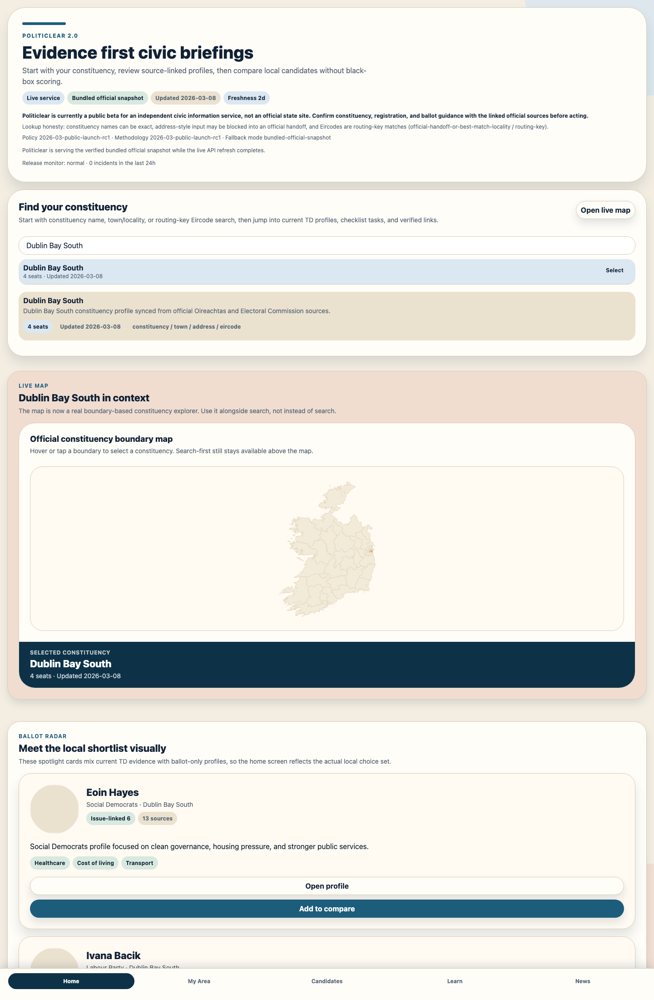
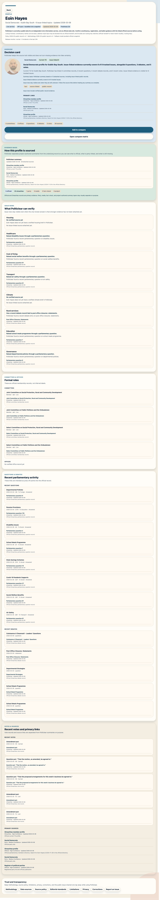
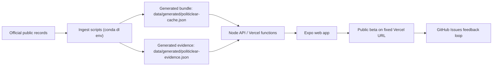

# Politiclear V2

Politiclear V2 is an evidence-first civic information app for Ireland. It helps a voter move from "What constituency am I in?" to "Who is on my ballot, what evidence is attached to these profiles, and which official sources should I check before acting?"

This repo is the 2026 continuation of the 2024 Hack Trinity prototype from [ParadauxIO/politiclear-app](https://github.com/ParadauxIO/politiclear-app). The current public beta is deployed at [https://skill-deploy-017ji4k0pl.vercel.app](https://skill-deploy-017ji4k0pl.vercel.app).

## Public Beta Status

Politiclear V2 is a `public beta`, not a full public launch.

- The fixed Vercel deployment is the right public testing surface for now.
- The app depends on API routes, candidate-image proxying, runtime bundle checks, and source-linked civic data, so GitHub Pages is not an appropriate host.
- Release promotion should only happen after the canonical deployment passes both repo gates and live-site gates as a `live` release.

## Why It Matters

Political information products often make two mistakes:

1. They show stale static profiles that quickly drift away from real ballots.
2. They flatten complex civic records into opaque scoring or recommendation systems.

Politiclear V2 takes a different approach:

- start with constituency and ballot context
- keep official links close to the interface
- expose issue coverage and visible unknowns
- preserve a trust, methodology, and corrections layer inside the product

## 2024 -> 2026 Upgrade

The 2024 baseline was a promising hackathon demo built around static JSON, a manual hotspot map, and a small sample of TD content. Politiclear V2 turns that foundation into a web-ready civic beta with generated official-data bundles, a server/API layer, richer candidate evidence, and a public-testing workflow.

### Product and data jump

| Area | 2024 baseline | 2026 v2 |
| --- | --- | --- |
| Constituencies | 4 demo constituencies | 43 constituencies |
| Current representatives | 19 sample TD profiles | 174 current representatives |
| Election candidates | None as a full ballot layer | 676 election candidates |
| Feed items | 3 static demo news items | 86 source-labeled feed items |
| Official resources | Ad hoc links | 11 official civic resource links |
| Parties | Minimal static display | 22 party records |

### Architecture jump

| Area | 2024 baseline | 2026 v2 |
| --- | --- | --- |
| Runtime | Expo demo app | Expo web + Node API + Vercel deployment |
| Screens | legacy static screens | 9 dedicated `v2` screens |
| Components | demo UI | 11 `v2` components |
| Data model | hardcoded JSON | generated civic bundles + evidence bundle |
| Deploy | local demo | fixed-link Vercel deployment + validation scripts |
| Ops | manual only | scheduled refresh workflow + release validation |

## What I Built In V2

This v2 continuation focuses on turning the original concept into a more credible civic product surface.

- Reframed the product around constituency discovery, candidate evidence, compare flow, and trust disclosures.
- Added a boundary-based constituency explorer instead of relying on the 2024 hotspot-map pattern.
- Built a candidate detail flow with source-linked evidence sections, official links, and issue-coverage visibility.
- Added compare, My Area, Learn Hub, News, and public-information screens tuned for a civic beta.
- Introduced a generated official-data bundle and evidence bundle to expand coverage from the small demo sample to national-level ballot context.
- Added a lightweight API/server layer and image proxy path to support the web deployment.
- Added release validation scripts, Vercel deployment scripts, and a scheduled data-refresh workflow.

## What Makes Politiclear Different

- Evidence-first candidate profiles instead of black-box scoring.
- Explicit source policy, methodology, corrections, privacy, and limitations pages inside the app.
- Constituency lookup honesty: exact name matches, locality best matches, and routing-key Eircode handling are distinguished instead of being presented as fake certainty.
- Local ballot context that combines current representatives, ballot-only candidates, and official next-step links.
- Public-beta release posture that keeps trust and transparency visible instead of pretending the product is already a finished civic authority.

## Screenshots

### Home dashboard



### Candidate detail



## Runtime Overview



## Repo Layout

- `src/screens/v2`: active public app screens
- `src/components/v2`: active public UI components
- `src/services`: data loading, merge logic, and client-side repository layer
- `server` and `api`: API routes and server bundle helpers
- `data/generated`: generated civic snapshot and evidence bundle

## Local Development

### Requirements

- Node.js 20+
- npm
- Conda with an environment named `dl`

### Common commands

```bash
npm ci
npm run verify:bundle
npm run build:vercel
npm run api
npm run web
```

### Data refresh commands

All Python-backed data commands intentionally run inside the `dl` conda environment:

```bash
npm run ingest:data
npm run sync:boundaries
npm run prepare:data
```

## Deployment

### Public beta deployment

Use Vercel Hobby with the fixed deployment URL. Do not migrate this app to a static host.

Required environment variables:

```bash
export VERCEL_CANONICAL_URL="https://skill-deploy-017ji4k0pl.vercel.app"
export VERCEL_PROJECT_SLUG="your-vercel-project-slug"
export VERCEL_SCOPE_SLUG="your-vercel-team-or-user"
export VERCEL_TOKEN="your-token"
```

Then run:

```bash
npm run deploy:preview
```

### Validation

```bash
npm run verify:bundle
VERCEL_CANONICAL_URL=https://skill-deploy-017ji4k0pl.vercel.app npm run validate:canonical
```

The canonical validation currently targets `public-beta` expectations. A future full public launch should switch the canonical deployment and validation flow to `live`.

## CI and Governance

- PR/push CI builds the web app, starts a local API, serves the exported site, and runs API/UI validation.
- Daily refresh can rebuild the official bundle and optionally deploy to the fixed Vercel URL when repo secrets and vars are configured.
- Public beta issue templates are included for bug reports and tester feedback.

## Public Feedback

- Use GitHub Issues for reproducible bugs, corrections, and product feedback.
- Use the in-app "Report an Issue" entry point for source-trail problems and civic-data corrections.
- See [FEEDBACK.md](./FEEDBACK.md) for the reporting guide.

## Rights and Release Strategy

- This repo should stay private until written consent is collected from all co-owners for the final public source license.
- The public beta demo can stay live on Vercel while source release remains private.
- The intended future public-code posture is source-available and non-commercial by default, with commercial licensing handled separately.
- See [CREDITS.md](./CREDITS.md) for project attribution and [COMMERCIAL-LICENSE.md](./COMMERCIAL-LICENSE.md) for the planned commercial-use position.
